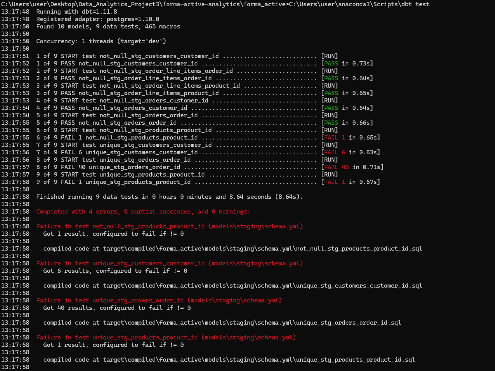
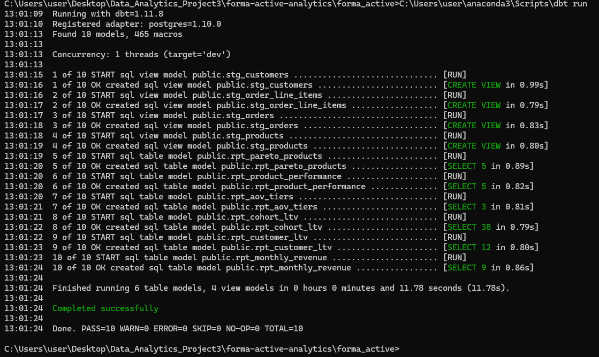
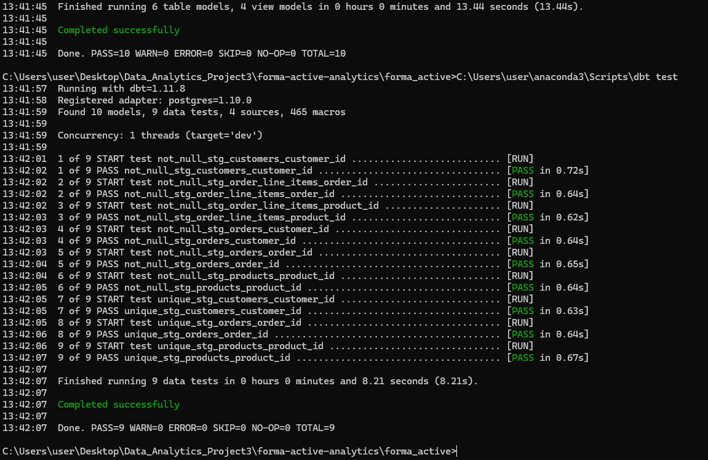
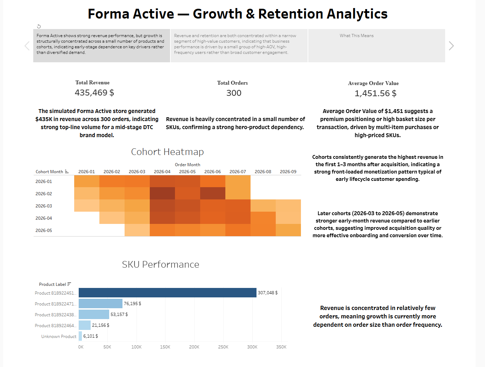
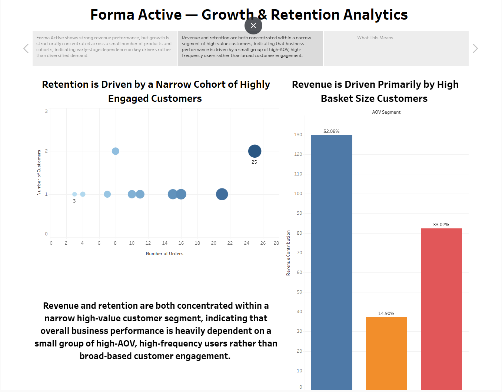
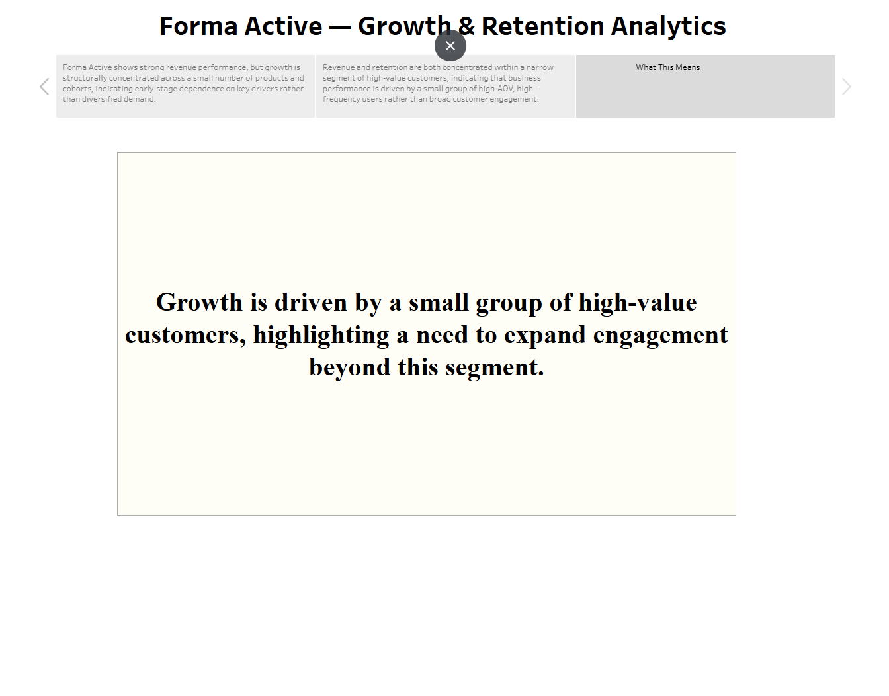

# 📊 Forma Active — End-to-End Ecommerce Analytics Engineering Pipeline
📖 Full project write-up (story + walkthrough):  
https://medium.com/@databykyrylop/forma-active-from-10-shopify-orders-to-a-dbt-modelled-warehouse-building-an-analytics-pipeline-1bd599f97e8c
## Overview

This project simulates a real-world analytics engineering workflow for a direct-to-consumer (DTC) ecommerce brand (“Forma Active”). It demonstrates a full end-to-end data pipeline covering data extraction, transformation, modeling, and business intelligence.

The project follows a production-style analytics architecture using Python, SQL, PostgreSQL, dbt, and Tableau to analyze revenue performance, customer behavior, product analytics, and retention patterns.

This project was developed iteratively through multiple ETL and modeling stages, including debugging of dbt models, schema adjustments, and synthetic data scaling for analytics simulation.

---

## Business Questions

This project was designed to answer key ecommerce analytics questions:

- How is revenue trending over time?
- Which customers generate the highest lifetime value (LTV)?
- Which products contribute most to revenue?
- Is growth driven by acquisition or retention?
- How concentrated is revenue across customers and SKUs?
- What do cohort retention patterns reveal about customer behavior?

## Data Architecture

```text
Shopify API
    ↓
Python ETL (data extraction + transformation)
    ↓
Synthetic Data Scaling (10 → 300 orders simulation layer)
    ↓
PostgreSQL (Neon data warehouse)
    ↓
SQL Analytics Layer (Q1–Q7 queries)
    ↓
dbt Transformation Layer (staging + marts + tests)
    ↓
Tableau Dashboards & Storytelling Layer
```


## Dataset

- Source: Shopify Admin API (development store)
- Initial dataset: 10 real orders
- Expanded dataset: 300 synthetic orders (relational integrity preserved)

### Core Entities
- customers  
- orders  
- order_line_items  
- products  

---

## Tech Stack

- Python (Pandas, Requests)
- PostgreSQL (Neon)
- SQL (analytics queries)
- dbt (data modeling + testing)
- Tableau (dashboards)
- Git & GitHub (version control)

---

## Project Highlights

- End-to-end analytics engineering workflow
- Synthetic scaling from 10 → 300 ecommerce orders
- Modular dbt transformation architecture
- Automated data quality testing
- Interactive Tableau dashboard storytelling
- Production-style warehouse modeling

---

## Data Engineering Notes

- Synthetic scaling (10 → 300 orders) simulates production workload
- All transformations are fully reproducible via SQL + dbt
- Notebook exploration was refactored into a production-style pipeline

---

# 🧱 Analytics Engineering Layer

## SQL Analytics (Exploratory Layer)

Before dbt modeling, SQL was used to validate business logic and explore key metrics:

- Monthly revenue trends  
- Top customer analysis  
- Product performance ranking  
- Repeat purchase behavior  
- AOV segmentation  
- Revenue concentration (Pareto analysis)  
- Cohort LTV analysis  

---

## Data Modeling (dbt Layer)

### Staging Models
- stg_customers  
- stg_orders  
- stg_order_line_items  
- stg_products  

**Responsibilities:**
- Cleaning raw data  
- Type normalization  
- Deduplication  
- Schema consistency  

---

### Mart Models (Business Layer)
- rpt_monthly_revenue — revenue trends  
- rpt_customer_ltv — customer lifetime value  
- rpt_product_performance — SKU ranking  
- rpt_aov_tiers — order value segmentation  
- rpt_pareto_products — revenue concentration  
- rpt_cohort_ltv — cohort retention + LTV  

---

## Data Quality & Testing

### Automated dbt Tests
- not_null constraints  
- unique key validation  
- referential integrity checks  

---

### ⚙️ dbt validation (development + debugging phase)


> Note: This execution represents a development-stage run where several tests failed during schema refinement and constraint tuning. Final production runs passed after iterative debugging.

---

### ⚙️ Pipeline Execution Success


---

### 🧪 Test Suite Passed


---

### Execution Results

- dbt run: 10/10 models successful  
- dbt test: 9/9 tests passed  

Validation stored in `/dbt/`.


---

## 📊 Tableau Dashboard

Interactive Tableau Public dashboard showcasing revenue performance, customer behavior, cohort retention, and product-level insights.

🔗 Live Dashboard:
https://public.tableau.com/views/FormaActiveRevenueRetentionAnalysis/FinalStory_FormaActiveGrowthRetentionAnalytics?:language=en-US&:sid=&:redirect=auth&:display_count=n&:origin=viz_share_link

### Dashboard Previews







📁 Tableau Workbook (optional local file):  
[Forma Active – Revenue & Retention Analysis.twbx](./tableau_public/Forma%20Active%20%E2%80%93%20Revenue%20%26%20Retention%20Analysis.twbx)

---


## Key Findings

- Product engagement follows a strong Pareto distribution — a small subset of listings drives the majority of reviews and activity.
- Pricing impact is category-dependent rather than universal; no single optimal price tier exists across all product groups.
- Wireless headphones show significantly higher engagement intensity compared to other categories, indicating stronger consumer demand signals.
- Ratings remain relatively stable across price tiers, suggesting price affects demand volume rather than perceived product quality.
- Cohort behavior indicates that repeat purchases significantly increase lifetime value, but growth is primarily driven by acquisition rather than retention.
- These findings are validated through SQL exploratory analysis and dbt modeling layers.
  
---

## Repository Structure

```text
ecommerce-analytics-forma-active/
│
├── dbt_project/                          # dbt transformation layer
│   ├── analyses/                         # ad-hoc dbt analysis queries
│   ├── macros/                           # reusable SQL macros
│   ├── models/
│   │   ├── marts/                        # business-level models (rpt_*)
│   │   │   ├── rpt_monthly_revenue.sql
│   │   │   ├── rpt_customer_ltv.sql
│   │   │   ├── rpt_product_performance.sql
│   │   │   ├── rpt_aov_tiers.sql
│   │   │   ├── rpt_pareto_products.sql
│   │   │   └── rpt_cohort_ltv.sql
│   │   │
│   │   └── staging/                     # staging models (stg_*)
│   │       ├── stg_customers.sql
│   │       ├── stg_orders.sql
│   │       ├── stg_order_line_items.sql
│   │       ├── stg_products.sql
│   │       ├── schema.yml
│   │       └── sources.yml
│   │
│   ├── seeds/
│   ├── snapshots/
│   ├── tests/
│   ├── dbt_project.yml
│   ├── README_dbt.md
│   └── .gitignore
│
├── sql/                                 # standalone SQL analytics layer (Q1–Q7)
│   ├── 01_monthly_revenue.sql
│   ├── 02_top_customers.sql
│   ├── 03_product_performance.sql
│   ├── 04_repeat_purchase.sql
│   ├── 05_aov_segmentation.sql
│   ├── 06_revenue_concentration.sql
│   ├── 06_revenue_concentration_pareto.sql
│   └── 07_cohort_ltv.sql
│
├── data/
│   └── query_outputs/                   # exported analysis results
│       ├── q1_monthly_revenue.csv
│       ├── q2_top_customers.csv
│       ├── q3_products_performance_clean.csv
│       ├── q4_repeat_purchase.csv
│       ├── q5_aov_segmentation.csv
│       ├── q6_revenue_concentration.csv
│       ├── q6_revenue_concentration_pareto.csv
│       └── q7_cohort_ltv.csv
│
├── notebooks/                           # ETL + exploration notebooks
│   ├── archive/
│   │   ├── 01_shopify_api_pull_messy.ipynb
│   │   ├── 02_postgres_load_messy.ipynb
│   │   ├── 03_adjustment_to_q3.ipynb
│   │   └── forma_active_clean.ipynb
│
├── tableau_public/                      # BI layer (Tableau workbook)
│   └── Forma Active – Revenue & Retention Analysis.twbx
│
├── visuals/                             # dashboard screenshots for README
│   ├── dashboard_slides/
│   │   ├── slide_1_performance.png
│   │   ├── slide_2_behaviour.png
│   │   └── slide_3_insight.png
│
├── dbt/                                 # dbt run/test outputs (evidence layer)
│   ├── dbt_pipeline_build_success.png
│   ├── dbt_tests_all_pass.png
│   └── dbt_data_quality_testing_results(staging_layer_validation).png
│
├── docs/
│   └── data_dictionary.md
│
└── README.md
```
## Data Dictionary

Available in:  
[docs/data_dictionary.md](./docs/data_dictionary.md)

---

## Project Status

✔ End-to-end analytics pipeline completed  
✔ dbt transformation layer implemented  
✔ SQL analytical layer (Q1–Q7) completed  
✔ Tableau dashboards built  
✔ Data quality testing implemented  
✔ Portfolio-ready analytics engineering project  

---

## Future Improvements

- Airflow or Prefect orchestration  
- Incremental dbt models for scalability  
- Live Shopify API integration  
- Automated data quality monitoring  
- Public BI deployment for dashboards  

---

## Data Source

Shopify Admin API (development store simulation)

---

## Closing Note

This project demonstrates a complete analytics engineering workflow, integrating extraction, transformation, modeling, and visualization into a reproducible end-to-end data pipeline.
This project reflects analytical patterns and correlations derived from a simulated ecommerce dataset and should be interpreted as exploratory business intelligence rather than causal inference.
